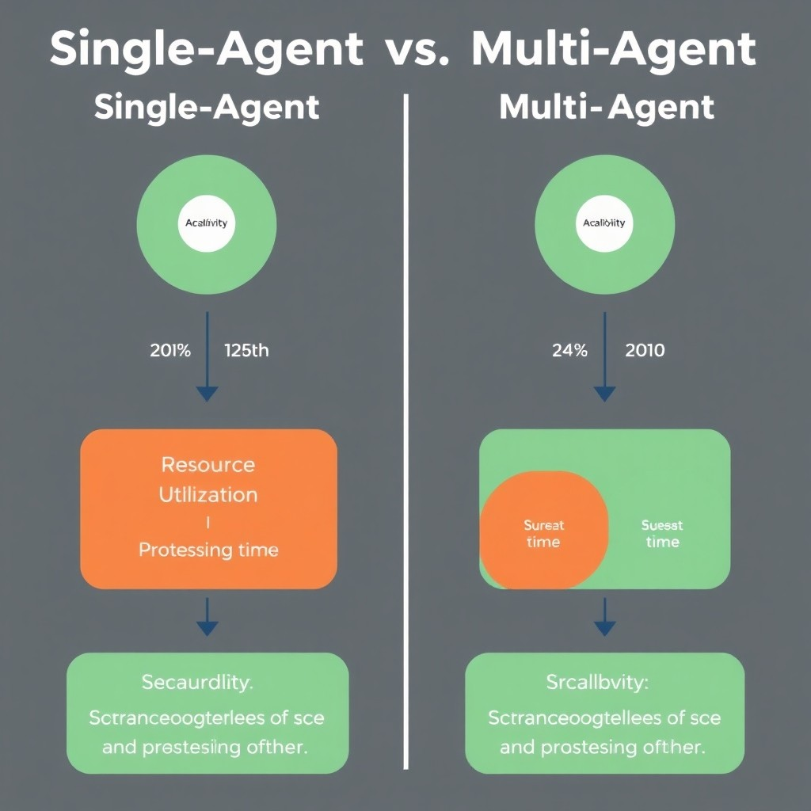
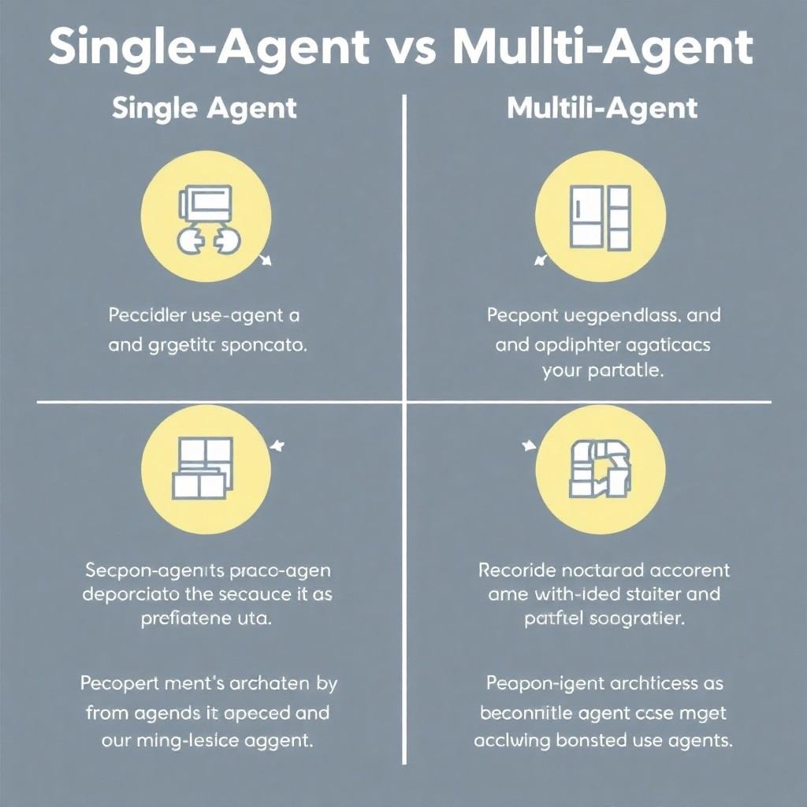
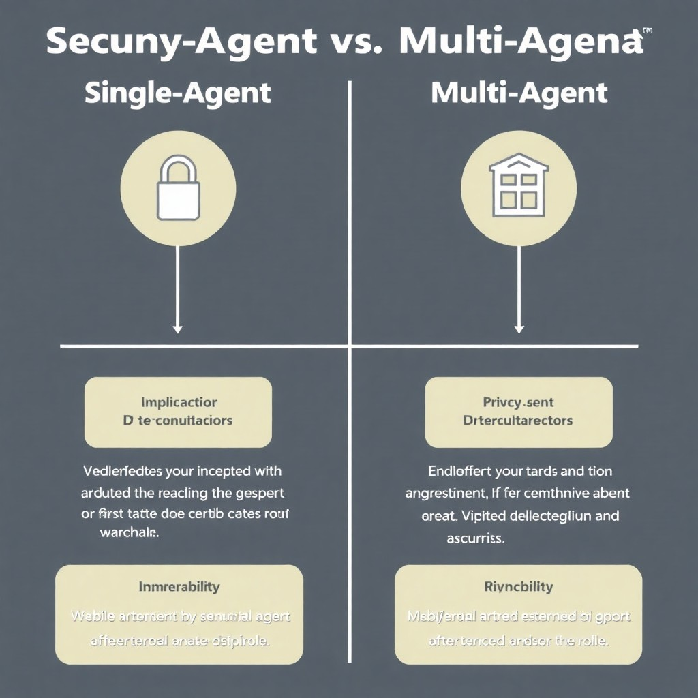

## Define Single-Agent Architecture

A single-agent architecture consists of a solitary entity that operates independently to achieve specified objectives. This architecture is characterized by a centralized flow of control, where the agent is responsible for decision-making and execution without relying on interactions with other agents. This approach is particularly useful in environments where tasks are well-defined and don't require collaboration or distributed problem-solving.

In operational contexts, single-agent systems thrive in scenarios that demand automation of straightforward tasks. For instance, they are commonly used in applications like web scrapers for gathering data from specific sites or automating repetitive business processes, like data entry or report generation. The simplicity of managing a single agent allows for a clear focus on a particular problem domain, which can lead to efficient and effective solutions.

However, there are limitations to single-agent architectures that developers must consider. One significant drawback is their lack of scalability. As the complexity of the problem domain grows or as the demand for performance increases, a single agent may struggle to cope with the higher workload or diverse tasks that need to be addressed. Unlike multi-agent systems, which can allocate tasks across multiple agents and handle more substantial workloads through parallel processing, single-agent systems may require more significant adjustments or complete redesign for scalability.

Additionally, adaptability is another limitation of single-agent architectures. When faced with dynamic environments or changing requirements, a single agent can be less flexible. The dependency on a single decision-making entity makes it challenging to implement rapid changes or to evolve processes in response to new information. While single-agent systems can offer simplicity and focus, developers need to weigh these benefits against potential challenges in scalability and adaptability when designing their applications.

## Define Multi-Agent Architecture

Multi-agent architecture is an approach in which multiple autonomous agents interact and cooperate to achieve individual or collective goals. Each agent operates independently, possessing its own capabilities, knowledge, and decision-making processes. This decentralized structure allows agents to collaborate by sharing information and negotiating to solve complex problems effectively.

### Organization and Interaction

In a multi-agent system, agents are organized in a manner that facilitates interaction. Agents can communicate through message-passing protocols or shared environments, allowing them to coordinate tasks and share insights. For example, when one agent discovers new information, it can notify other agents to update their knowledge base, enabling a more comprehensive understanding of the situation at hand. This inter-agent communication is often built on standards such as FIPA ACL (Agent Communication Language), ensuring seamless integration and interoperability.

### Use Cases

Multi-agent systems shine in scenarios requiring complex problem-solving capabilities or distributed processing. Key use cases include:

- **Robotics**: Swarming behavior in robotic systems where multiple robots work together to accomplish tasks like search and rescue.
- **Supply Chain Management**: Autonomous agents manage inventory and logistics to optimize costs and delivery times.
- **Smart Grid Management**: Agents monitor and control energy distribution efficiently while accommodating real-time changes in energy usage.

These examples highlight how multi-agent systems can leverage distributed intelligence to enhance performance and adaptability in dynamic environments.

### Challenges

Despite their advantages, multi-agent systems come with their own set of challenges. A significant concern is the **coordination overhead**; as more agents are added, the complexity of communication increases, which can slow down response times. Additionally, ensuring that agents correctly interpret information can lead to **communication overhead**, potentially resulting in misalignment of goals or inefficiencies. Developers must design robust protocols and mechanisms to mitigate these issues while maintaining performance. 

In summary, while multi-agent architectures offer flexible and powerful solutions for complex tasks, careful consideration of their organizational structure and communication strategies is crucial to harness their full potential.

## Compare Performance Aspects



*Comparison of performance aspects such as processing time, resource utilization, and scalability of Single-Agent vs Multi-Agent architectures.*

When considering performance in the context of single-agent and multi-agent architectures, several factors come into play, including processing time, resource utilization, and scalability under stress.

### Benchmark Processing Time

One of the critical differences lies in benchmarking processing time for specific tasks. Single-agent architectures generally provide lower throughput for tasks that can be parallelized, since they rely on a single main processing unit. In contrast, multi-agent architectures can execute multiple tasks concurrently, often leading to significant performance gains. For instance, during throughput tests, a multi-agent system may complete a large number of simultaneous transactions more quickly than a single-agent configuration, depending on task complexity and inter-agent communication overhead. 

### Resource Utilization Patterns

When it comes to resource utilization, particularly in terms of memory and CPU usage, the differences are stark. Single-agent architectures typically have lower memory overhead due to the absence of multiple agents maintaining their states. However, this simplicity comes at the cost of CPU efficiency, as tasks that could be parallelized are handled sequentially. Multi-agent architectures often use more memory as each agent maintains its state and context; however, they can distribute CPU workloads more effectively. Performance metrics indicate that under heavy load, while memory usage may spike, the overall CPU load is often balanced better, leading to less contention and a smoother operation across multi-agent systems.

### Scalability Under Load

Scalability is a crucial performance aspect, especially during load and stress testing conditions. Single-agent architectures may struggle as the system load increases, often reaching a bottleneck where resource contention occurs. In contrast, multi-agent architectures are designed for scalability. They can effectively distribute workloads among multiple agents, allowing the system to handle a significantly higher number of transactions or operations concurrently without degrading performance. This is particularly advantageous in environments where demand can vary widely, providing elasticity and robust performance under varying loads.

In summary, while single-agent architectures may provide simplicity and lower overhead for tasks that are inherently sequential, multi-agent architectures shine in environments that require high concurrency and scalability. The performance gains achieved through parallel processing in multi-agent systems often outweigh the increased resource utilization, especially as workloads grow. Therefore, the choice of architecture will heavily depend on your specific application needs and expected load conditions.

## Examine Use Cases



*Visual representation of various use cases demonstrating the strengths of Single-Agent vs Multi-Agent architectures in different scenarios.*

When deciding between single-agent and multi-agent architectures, it's crucial to look at specific scenarios that highlight the strengths of each approach.

### Single-Agent Architectures

Single-agent architectures are particularly advantageous in straight-forward applications where the complexity of coordination between multiple agents can lead to inefficiencies. A prime example of this is **data entry applications**. These systems typically require a singular point of control for executing tasks like input verification, data processing, and reporting. By leveraging a single agent, developers can effectively manage operation flows without the overhead associated with inter-agent communication.

Another scenario where single-agent setups shine is in **simple user interfaces**. For instance, applications that primarily collect user input and present data can benefit from the simplicity of a single-agent model, which results in reduced development time and easier maintenance.

### Multi-Agent Architectures

On the other hand, multi-agent architectures are better suited for **complex applications** that require extensive interactions among various agents. Notable scenarios include **simulations** where independent entities represent different components of the environment. In these cases, agents can work concurrently to mimic real-world interactions, providing a more dynamic experience. For example, multi-agent setups are widely used in traffic simulation models, where each agent represents a vehicle, allowing for the modeling of diverse behaviors and responses.

Additionally, multi-agent systems excel in **distributed AI** applications, such as collaborative robotic scenarios where agents must coordinate tasks to achieve shared objectives. This approach allows for scalability and modularity, enabling the system to adapt to varying levels of workload or environmental changes.

### Hybrid Approaches

Combining both architectures can lead to enhanced performance in specific environments where the unique advantages of each can be utilized. For instance, a **hybrid approach** may consist of a single agent managing overall system objectives, while multiple agents handle specific tasks. This model can balance the consistency and control of single-agent systems with the scalability and flexibility of multi-agent systems.

Such a setup can be beneficial in real-time data processing applications, where a central agent aggregates and processes data from multiple sources, while specialized agents analyze specific dimensions of that data, leading to a more efficient and responsive system. By carefully evaluating the requirements of your application, you can select the most appropriate architectural pattern or even create a hybrid that maximizes operational efficiency.

## Security and Privacy Considerations



*A comparative overview of security and privacy considerations between Single-Agent and Multi-Agent architectures.*

When considering the deployment of single-agent versus multi-agent architectures, it is crucial to understand the distinct security implications of each. Multi-agent systems, while offering advantages in distributed processing and autonomy, also exhibit unique vulnerabilities that can expose systems to various attacks.

One significant concern in multi-agent systems is coordination attacks. These occur when multiple agents work in tandem without adequate safeguarding measures, leading to potential exploitation by malicious entities. For instance, an attacker can manipulate the decision-making process among agents to disrupt normal functioning or extract sensitive information. Additionally, data privacy issues are paramount. Multiple agents can access, share, and store vast amounts of data, increasing the risk of unauthorized access and data breaches. The challenge is compounded when agents operate in different environments or jurisdictions, making compliance with data protection laws more complex.

In contrast, single-agent architectures generally present fewer vulnerabilities. However, they still require thoughtful security measures. Access controls serve as the first line of defense, ensuring that only authorized users can interact with the system. Implementing role-based access control (RBAC) can help limit the actions a user can take, thus reducing the attack surface. Furthermore, data encryption is vital for safeguarding sensitive information stored or transmitted by the agent. Employing strong encryption standards, like AES-256, helps protect data from interception during transit, ensuring that even if data is accessed by unauthorized actors, it remains unreadable.

For multi-agent systems, secure communication is essential. Agents need to share information efficiently while maintaining security protocols. Best practices for achieving secure communication include:

- **Using Secure Protocols**: Implementing protocols such as HTTPS or TLS ensures that data exchanged between agents remains encrypted.
- **Authenticating Agents**: Utilizing digital signatures or public key infrastructures allows agents to verify each other's identities before data exchange.
- **Implementing Redundancy**: Introducing mechanisms for detecting and responding to anomalous behavior can mitigate potential attacks and maintain system integrity.

In summary, both single-agent and multi-agent architectures present unique security challenges. Multi-agent systems are susceptible to coordination attacks and data privacy risks, requiring robust defensive strategies. Conversely, single-agent architectures rely on stringent access controls and encryption to secure sensitive data. Proper implementation of security measures, combined with adherence to best practices in communication, will ensure a more secure deployment irrespective of the chosen architecture.

## Debugging and Observability in Architectures

Debugging and observability are critical in both single-agent and multi-agent architectures. Each approach has unique challenges and requires tailored strategies to ensure effective monitoring and troubleshooting.

### Tools and Techniques for Tracing Single-Agent Workflows

In single-agent architectures, workflows can often be traced linearly, which simplifies debugging. Here are some effective tools and techniques:

- **Integrated Development Environments (IDEs)**: Tools like Visual Studio Code or IntelliJ provide built-in debuggers that allow step-through debugging, variable inspection, and real-time execution tracing.

- **Profilers**: Tools such as Py-Spy or YourKit can track function calls, helping you identify performance bottlenecks and flow of execution.

- **Unit Testing Frameworks**: Utilizing frameworks like JUnit or pytest allows for testing individual components, ensuring each part works correctly before integrating into the larger system.

- **Code Instrumentation**: Adding logging statements or using decorators for function entry and exit can help trace workflow execution dynamically. A simple Python example for logging may look like:

  ```python
  import logging

  logging.basicConfig(level=logging.INFO)

  def example_function(param):
      logging.info(f"Function called with parameter: {param}")
      # Function logic here
  ```

### Challenges in Debugging Multi-Agent Communications

Multi-agent systems introduce complexities in communication and state management, leading to unique debugging challenges:

- **Asynchronicity**: Agents often operate independently and asynchronously, making it difficult to trace interactions or detect where issues occur in the workflow.

- **Message Passing**: When agents communicate via messages, tracking the state of these messages and ensuring they are delivered correctly can be problematic. Tools like message brokers (e.g., RabbitMQ, Kafka) can log message flows, aiding in tracing and debugging.

- **Race Conditions**: The concurrent nature of multi-agent architectures increases the likelihood of race conditions, causing unexpected behavior. Debugging tools like concurrency visualizers help identify potential race conditions by providing insights into agent interactions over time.

To address these challenges, consider implementing:

- **Centralized Logging**: Use a logging aggregation tool (like ELK Stack) to capture logs from all agents in one place. This facilitates cross-agent tracing.

- **Health Checks and Metrics**: Implementing health checks and monitoring metrics (e.g., response times and error rates) can provide insights into the system's state and help identify problematic agents.

### Logging Strategies for Enhanced Observability

Both single-agent and multi-agent architectures can benefit from robust logging strategies to improve observability:

- **Structured Logging**: Using structured formats (JSON, XML) for your logs allows for easier searching, filtering, and analysis.

- **Log Levels**: Implement different log levels (DEBUG, INFO, WARNING, ERROR) to manage the verbosity of logs based on the environment. For instance:

  ```python
  logging.basicConfig(level=logging.DEBUG)

  def critical_function():
      logging.debug("Debugging critical function")
      # Function logic here
  ```

- **Correlation IDs**: Using correlation IDs in log entries can help track a request's journey through both single-agent and multi-agent systems, making it easier to connect the dots between logs.

By integrating these debugging and observability practices into your development workflow, you can significantly enhance the reliability and maintainability of both single-agent and multi-agent architectures.

## Future Trends in Agent-Based Architectures

The landscape of agent-based architectures is rapidly evolving, particularly as research and development efforts intensify in multi-agent systems. Active areas of research include improving communication protocols among agents, enhancing cooperation strategies for complex problem-solving, and developing robust mechanisms for agent learning. These innovations aim to enable agents to work seamlessly together, adapting to dynamic environments and leveraging collective intelligence, which is crucial for applications ranging from robotics to smart cities. Emerging methodologies like reinforcement learning are being integrated into agent frameworks, allowing agents to learn and adapt based on real-world experiences ([Source](URL)).

The rise of artificial intelligence (AI) has significant implications for single-agent architectures. As AI technologies become more sophisticated, single-agent systems are increasingly capable of executing complex tasks that were once the realm of multi-agent systems. Enhanced machine learning algorithms enable these agents to analyze data and make decisions with minimal human intervention, improving efficiency across various applications such as process automation and predictive analytics. Furthermore, AI-driven agents can now learn over time, refining their workflows and insights, thus pushing the boundaries of what single-agent systems can achieve ([Source](URL)).

Integrating newer technologies like blockchain and the Internet of Things (IoT) with agent-based architectures is another trend to watch. In the context of IoT, multi-agent systems can help manage the vast amounts of data generated by connected devices, providing real-time insights and optimizing resource allocation. Blockchain technology introduces the potential for decentralized decision-making and security features, enabling agents to operate in a trustless environment. This integration can enhance the security and reliability of agent interactions, particularly in sensitive applications like supply chain management or financial transactions ([Source](URL)).

In conclusion, the future of agent-based architectures is poised for growth as research continues to unveil new methodologies and applications. The intersection of AI, IoT, and blockchain will catalyze further innovations, pushing both single-agent and multi-agent systems towards greater autonomy, intelligence, and effectiveness in complex, interconnected environments.